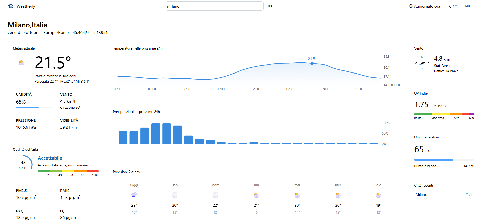

# Weatherly – Dashboard meteo e qualità dell'aria

Dashboard in tempo reale: cerchi una città e vedi condizioni attuali, previsioni orarie e settimanali, qualità dell'aria, indice UV, vento e umidità.



## Funzionalità

- Ricerca della città con debounce (500 ms) e menu a tendina dei risultati
- Meteo attuale: temperatura e temperatura percepita, icona e descrizione del cielo (codici WMO), umidità, vento, pressione e visibilità
- Grafici delle prossime 24 ore: temperatura e probabilità di pioggia
- Previsioni dei prossimi 7 giorni con minime e massime
- Qualità dell'aria: indice europeo (AQI) con indicatore circolare, PM2.5, PM10, NO₂ e O₃
- Indice UV, vento con direzione e raffiche, umidità relativa e punto di rugiada, alba e tramonto
- Cronologia delle ultime 4 città cercate, salvata in `localStorage`
- Messaggi chiari quando nessuna città è selezionata, durante il caricamento e in caso di errore
- Layout responsive: una colonna su telefono, due su tablet, tre su desktop

## Tecnologie

- **React 19** e **TypeScript**
- **Vite** come bundler
- **TanStack Query v5** per il recupero e la cache dei dati
- **Tailwind CSS v4** per lo stile
- **Recharts** per i grafici
- **ESLint** per il controllo del codice

## API utilizzate

Tutte gratuite e senza API key, fornite da [Open-Meteo](https://open-meteo.com/):

- [Geocoding API](https://open-meteo.com/en/docs/geocoding-api): ricerca della città e coordinate
- [Forecast API](https://open-meteo.com/en/docs): meteo attuale e previsioni
- [Air Quality API](https://open-meteo.com/en/docs/air-quality-api): qualità dell'aria

## Come avviarlo

Requisiti: [Node.js](https://nodejs.org/) 20.19 o successivo (consigliato 22 LTS).

```bash
git clone https://github.com/francescoesposito-geeks/weather-dashboard.git
cd weather-dashboard
npm install
npm run dev
```

Poi apri [http://localhost:5173](http://localhost:5173) nel browser.

Altri comandi:

| Comando           | Cosa fa                                 |
| ----------------- | --------------------------------------- |
| `npm run build`   | Controllo dei tipi e build di produzione |
| `npm run preview` | Avvia la build di produzione in locale  |
| `npm run lint`    | Controllo del codice con ESLint         |

## Struttura del progetto

```
src/
├── components/
│   ├── Navbar/             # barra di ricerca della città
│   ├── TopBar/             # città selezionata e data
│   ├── FirstColumnMain/    # meteo attuale, qualità dell'aria, alba e tramonto
│   ├── SecondColumnMain/   # grafici delle 24 ore e previsioni a 7 giorni
│   └── ThirdColumnMain/    # vento, indice UV, umidità, città recenti
├── hooks/                  # useGeocoding, useWeather, useAirQuality
├── pages/                  # layout della dashboard
├── services/api.ts         # chiamate alle API Open-Meteo
├── types/weather.ts        # tipi TypeScript delle risposte API
└── App.tsx                 # stato dell'app e gestione della ricerca
```

## Scelte tecniche

- Le chiamate alle API sono separate in `services/api.ts` e le risposte sono tipizzate con interfacce TypeScript.
- Ogni API ha il suo custom hook basato su TanStack Query: i dati restano in cache e la richiesta parte di nuovo da sola quando cambiano le coordinate, perché fanno parte della `queryKey`.
- La ricerca usa un debounce, così l'API non viene chiamata a ogni tasto premuto.

## Prossimi miglioramenti

- Non avviare le richieste meteo finché non è stata scelta una città (opzione `enabled` di TanStack Query)
- Rendere cliccabili le città recenti
- Rendere funzionante il selettore °C / °F
- Risolvere gli avvisi di ESLint (tipi `any`, `setState` dentro `useEffect`)
- Aggiungere test automatici dei componenti

## Contesto

Progetto realizzato come esercitazione durante lo stage da sviluppatore web presso Geekcreations S.r.l. (marzo–aprile 2026). Il testo originale dell'esercizio è in [docs/consegna-esercizio.md](docs/consegna-esercizio.md).